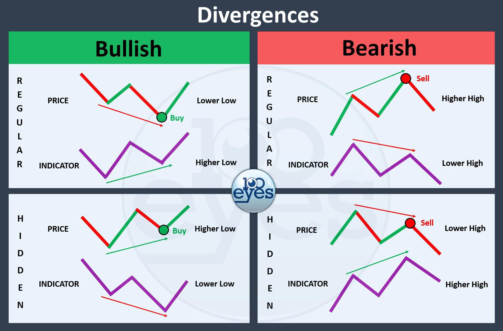
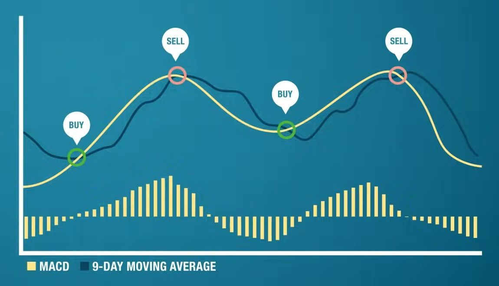
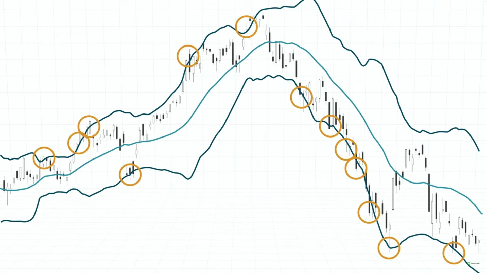

# Relative Strength Index - RSI

It's an oscillator signal showing a stock's momentum i.e. if it's overbought/oversold, to help determine when to buy/sell.

A 10 period (day, hour, minute) RSI shows a number between 0 and 100 of the ratio between the up and down closing price periods.

In the settings, you can choose an overbought and oversold threshold, usually 70 and 30. Sell if the RSI exceeds 70, buy if it falls below 30.

```
RSI = 100 - 100 / (1 + RS)

RS = Average of n days up / Average of n days down
```

nekoj tekst bal bla

## RSI Divergence

It's shows reversals i.e. the price movement is the opposite of the RSI.

There are quite a few RSI signals occuring, but a much stronger signal is one of these rare combinations.



# Moving Average Convergence Divergence - MACD

Momentum indicator showing trends by looking at the difference between two moving averages.

-   Fast moving average (12 days).
-   Slow moving average (26 days).

The MACD indicator is used with a signal line (9 days) too look for crossovers as buy/sell signals.

There's also a histogram that shows the crossovers much more clearly.

Buy when the MACD crosses below the signal line, sell when it crosses above it.



# VWAP

# Bollinger Bands

The bands account for 95% of the price movements.

Any breakout is a signal for entry/exit.

Buy during lower band breakouts on an upward slope.

Sell during upper band breakouts.



# Price Action

The strategy relies on momentum loss, shown through candle sizes and shapes. It shows the likelihood of a support/resistance level.

The key to spotting high probability reversal trades is in seeing candles getting smaller as they approach a level of support/resistance as it shows a losing momentum.

Look for a candle color change at support or resistance. Be very careful when you see large candles approaching support/resistance.

# Stochastic
