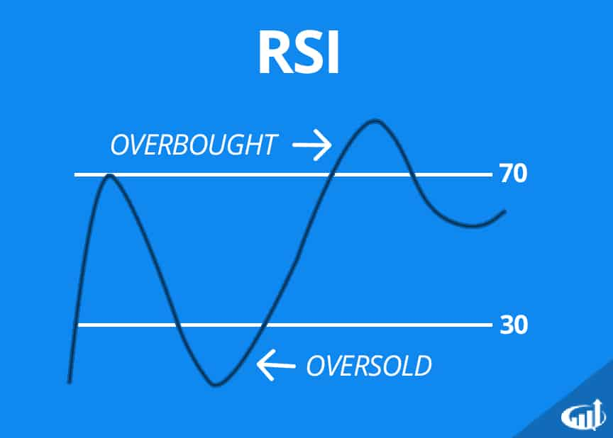

# Relative Strength Index - RSI

It's an oscillator signal showing a stock's momentum i.e. if it's overbought/oversold, to help determine when to buy/sell.

A 10 period (day, hour, minute) RSI shows a number between 0 and 100 of the ratio between the up and down closing price periods.

In the settings, you can choose an overbought and oversold threshold, usually 70 and 30.

Sell if the RSI exceeds 70, buy if it falls below 30.

```
RSI = 100 - 100 / (1 + RS)

RS = Average of n days up / Average of n days down
```



**RSI Divergence**

It's shows reversals i.e. the price movement is the opposite of the RSI.

There are quite a few RSI signals occuring, but a much stronger signal is one of these rare combinations.


